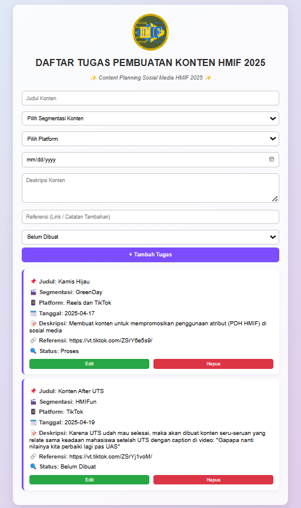

# Dashboard Tugas Pembuatan Konten HMIF 2025

-> Merupakan sebuah aplikasi web sederhana untuk membantu divisi konten HMIF ITERA dalamn mengelola, merencanakan dan menjadwalkan konten media sosial HMIF.

## Fungsi Aplikasi

Aplikasi ini berfungsi sebagai **dashboard manajemen konten**, yang memungkinkan pengguna:

- Menambahkan, mengedit, dan menghapus tugas konten/content planning.
- Menentukan platform konten (Feeds, Reels, TikTok, dll).
- Menyimpan data secara lokal menggunakan `localStorage`.
- Memfilter dan mengelompokkan konten berdasarkan segmentasi (GreenDay, HMIFStoryline, dsb).
- Membantu menjadwalkan kapan konten tersebut harus diupload melalui fitur tanggal.
- Menandai status progress (Belum Dibuat, Proses, Revisi, Selesai Diupload).

## Fitur Aplikasi

- Tambah, edit, dan hapus konten.
- Dropdown segmentasi konten, platform dan status.
- Penyimpanan data otomatis menggunakan `localStorage`.
- Tampilan responsif dan user-friendly.

## Fitur ES6+ yang Diimplementasikan

- `const`, `let` untuk deklarasi variabel agar lebih aman dan sesuai konteks (block-scoped).
- Arrow function yaitu fungsi pendek yang lebih ringkas dan tidak memiliki this sendiri.
- Template literal untuk menyusun string dengan ${} di dalam backtick, membuat kode lebih rapi.
- Destructuring object untuk mengambil properti dari objek secara langsung ke variabel.
- LocalStorage 	untuk menyimpan data secara lokal di browser agar tidak hilang saat halaman direfresh.
- Ternary Operator untuk kondisi sederhana dalam satu baris, menggantikan if-else yang panjang.
- Conditional Rendering untuk menampilkan elemen HTML berdasarkan kondisi tertentu secara dinamis.
- Array Method (forEach, filter) untuk memproses array dengan cara yang lebih bersih dan modern.
- Modular DOM event listener (`DOMContentLoaded`, `addEventListener`) yaitu event binding diletakkan secara modular agar mudah dibaca dan di-maintain.
- Anonymous functions dan callback digunakan dalam button (seperti edit & delete) untuk penanganan per item konten.

## Teknologi yang Digunakan

- HTML5
- CSS3 (Custom styling)
- JavaScript ES6+
- LocalStorage

## Screenshot Aplikasi

## Cara Menjalankan

1. Clone repository / download zip.
2. Buka file `index.html` di browser.
3. Semua data akan tersimpan otomatis di `localStorage`.
